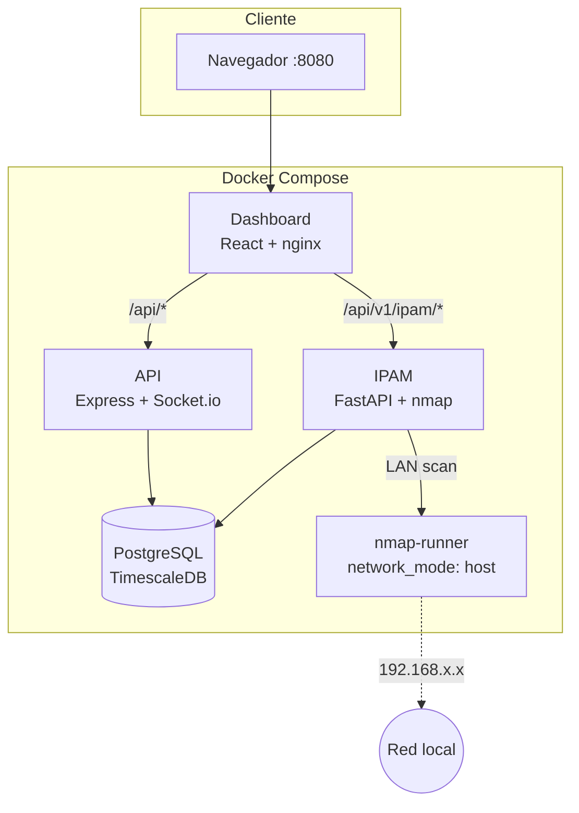
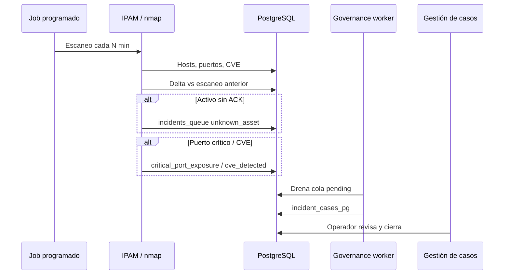
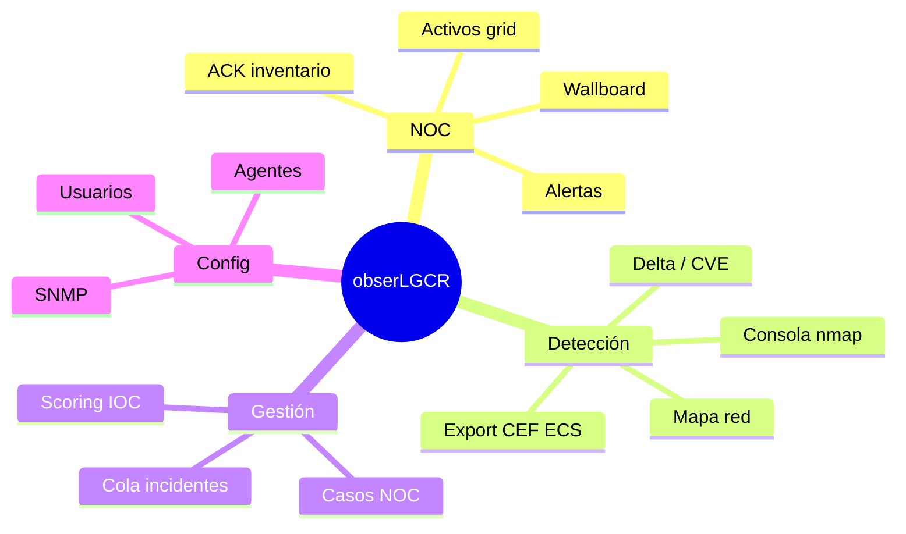

<div align="center">

# obserLGCR

**Observabilidad, NOC y gobernanza de activos** — fork demo/laboratorio de LegacyHunt.

PostgreSQL · API Express · Dashboard React · IPAM · nmap · sin Trino/MinIO/Keycloak.

[](docker-compose.yml)
[](docs/instalacion.md)
[](dashboard/)
[](ipam/)
[](LICENSE)

[Instalación](docs/instalacion.md) · [Arquitectura](docs/arquitectura.md) · [Descubrimiento nmap](docs/descubrimiento-nmap.md) · [API](docs/api.md)

</div>

---

## Qué es

Plataforma unificada para **monitorear infraestructura**, **descubrir activos en red**, **gestionar incidentes** y **gobernar inventario** (ACK, shadow IT, hallazgos de seguridad).

Pensada para laboratorio, demos NOC/SOC y despliegues compactos en VPS — un solo `docker compose up` y listo.

| Capacidad | Descripción |
|-----------|-------------|
| **NOC** | Grid de activos por familia, métricas, alertas, wallboard, ACK inventario |
| **Descubrimiento** | GUI tipo nmap: perfiles, delta, CVE, puertos críticos, export SIEM |
| **Gobernanza** | Activos sin ACK, CVE y puertos críticos → cola → casos en Gestión |
| **Detección** | KPIs, fuentes, explorador de eventos, IPAM, activos unificados |
| **Gestión** | Cola SOC, scoring IOC, cierre de casos, timeline |

---

## Arquitectura



### Flujo de gobernanza (descubrimiento → incidente)



---

## Módulos del dashboard

| Módulo | Ruta principal | Destacado |
|--------|----------------|-----------|
| **NOC** | `/noc` | **Activos** (vista por defecto), wallboard, alertas, sitios |
| **Detección** | `/detection` | Fuentes, explorador, IPAM, **descubrimiento nmap GUI** |
| **Gestión** | `/gestion` | Casos SOC, scoring, gobernanza NOC, cierre |
| **Config** | `/admin/settings` | Usuarios, agentes, SNMP |



---

## Inicio rápido

```bash
git clone -b main https://github.com/arl3t/obserLGCR.git
cd obserLGCR
cp .env.example .env
docker compose up -d --build
./scripts/migrate.sh    # migraciones (dentro del contenedor API)
```

| Servicio | URL |
|----------|-----|
| Dashboard | http://localhost:8080 |
| API health | http://localhost:8787/api/health |
| IPAM (directo) | http://localhost:8790 |

**Login** (`/login`):

| Email | Contraseña | Rol |
|-------|------------|-----|
| `admin@obserlgcr.local` | `changeme-admin` | admin |
| `operator@obserlgcr.local` | `changeme-operator` | analyst |

Tras login la app abre en **NOC → Activos**. Modo lab sin login: [docs/seguridad.md](docs/seguridad.md#modo-lab-sin-login).

### Actualizar en VPS

```bash
cd ~/obserLGCR
git pull
docker compose up -d --build
./scripts/migrate.sh
```

> No ejecute `node api/migrate.mjs` en el host sin `npm ci` en `api/` — use `./scripts/migrate.sh`. Ver [docs/instalacion.md](docs/instalacion.md).

---

## Descubrimiento nmap (resumen)

| Función | Detalle |
|---------|---------|
| Perfiles | discovery, rápido, estándar, completo, sigiloso, CVE, custom |
| Programación | Cada X minutos o cron — detecta activos nuevos |
| Delta | Compara dos escaneos (hosts/puertos nuevos o cerrados) |
| Seguridad | Alertas puertos críticos, tabla CVE, índice de riesgo |
| Informes | JSON, CSV, XML nmap, CEF, ECS |
| Incidentes | Sin ACK, CVE y puertos críticos → Gestión |

Escaneo de **LAN** (`192.168.x.x`): requiere `nmap-runner` en el host. Ver [docs/descubrimiento-nmap.md](docs/descubrimiento-nmap.md).

---

## Stack técnico

```
┌─────────────────────────────────────────────────────────────┐
│  Dashboard :8080   React 19 · Vite · TanStack Query         │
│  nginx → proxy /api y /api/v1/ipam                          │
└──────────────────────────┬──────────────────────────────────┘
                           │
         ┌─────────────────┼─────────────────┐
         ▼                 ▼                 ▼
   API :8787          IPAM :8790      nmap-runner :8791
   Express 4          FastAPI         (red del host)
   Socket.io          scheduler       escaneo LAN
         │                 │
         └────────┬────────┘
                  ▼
         PostgreSQL / TimescaleDB :5433
         casos · NOC · discovery · IPAM · cola incidentes
```

| Carpeta | Rol |
|---------|-----|
| `api/` | API Express, migraciones, workers de gobernanza |
| `dashboard/` | SPA React, módulos NOC/Detección/Gestión |
| `ipam/` | Inventario IP, descubrimiento nmap, export |
| `scripts/` | `migrate.sh`, `nmap-host-runner.py`, agentes |
| `docs/` | Documentación completa |

---

## Documentación

| Guía | Descripción |
|------|-------------|
| [Índice](docs/README.md) | Punto de entrada |
| [Instalación](docs/instalacion.md) | Docker, login, troubleshooting VPS |
| [Registro de activos](docs/registro-activos.md) | Agente NOC, inventario, SNMP |
| [Descubrimiento nmap](docs/descubrimiento-nmap.md) | Host runner y escaneo de red |
| [Arquitectura](docs/arquitectura.md) | Componentes y flujo de datos |
| [Módulos](docs/modulos.md) | NOC, Detección, Gestión, Config |
| [NOC](docs/modulo-noc.md) | Monitoreo y agentes |
| [API REST](docs/api.md) | Endpoints del fork |
| [Configuración](docs/configuracion.md) | Variables `.env` |
| [Desarrollo](docs/desarrollo.md) | Local sin Docker |
| [Seguridad](docs/seguridad.md) | Auth, OIDC, buenas prácticas |

---

## Autenticación

Por defecto: **login local** (`POST /api/auth/login` → JWT). En modo lab el API no exige OIDC en cada petición (`OIDC_ENABLED=false`).

---

## Licencia

[GNU General Public License v3.0](LICENSE)
