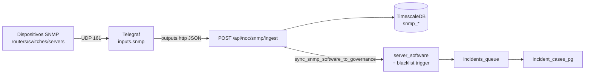

# NOC — Recolección SNMP con Telegraf

## Arquitectura



## 1. Configuración Telegraf

Archivo: [`deploy/telegraf/telegraf.conf`](../deploy/telegraf/telegraf.conf)

| Plugin | MIB / OID | Destino hypertable |
|--------|-----------|-------------------|
| `snmp.sys` | sysUpTime, sysDescr, sysName | `snmp_availability` + `keepalive_status` |
| `snmp.cpu` | ssCpuUser/Idle, hrProcessorLoad | `snmp_cpu` |
| `snmp.storage` | hrStorageUsed/Size | `snmp_memory` |
| `snmp.if` | ifHCInOctets, ifHCOutOctets, errors | `snmp_interface_traffic` |
| `snmp.swInstalled` | hrSWInstalledTable (.1.3.6.1.2.1.25.6.3) | `snmp_software_inventory` |

**Salida recomendada:** `outputs.http` → `POST /api/noc/snmp/ingest` (Bearer agent JWT).

**Alternativa:** `outputs.postgresql` (comentado en conf) — tablas `telegraf_*` + vistas ETL.

### Despliegue

```bash
# Variables
export SNMP_COMMUNITY=public
export SNMP_TARGET_1=192.168.1.254
export NOC_AGENT_TOKEN=$(curl -s -X POST http://localhost:8787/api/auth/token \
  -H 'Content-Type: application/json' \
  -d '{"email":"noc-agent@obserlgcr.local","password":"changeme-noc-agent"}' | jq -r .token)

docker compose -f docker-compose.yml -f docker-compose.telegraf.yml up -d telegraf
```

## 1b. Descubrimiento SNMP en segmento (scan + registro)

Escanea un CIDR probando **varias communities** (GET `sysName` / `sysDescr`). Los hosts que respondan se registran en `noc_devices` y `snmp_targets` con la community que funcionó.

### UI

**Configuración → SNMP** — sección *Descubrimiento SNMP en segmento*:

- CIDR (ej. `192.168.1.0/24`, máx. 512 hosts)
- Communities (coma-separadas; se persisten en `noc_platform_settings.discovery_communities`)
- Sitio opcional
- Checkbox *Registrar automáticamente*

### API

```bash
curl -X POST http://localhost:8787/api/noc/snmp/discover \
  -H 'Content-Type: application/json' \
  -d '{
    "cidr": "192.168.1.0/24",
    "communities": ["public", "lgcr-ro"],
    "site": "DC-ASU",
    "register": true
  }'
```

Respuesta: `{ hosts_scanned, hosts_found, hosts_registered, results[] }` con `ip`, `community`, `sys_name`, `device_id`.

**Requisito de red:** el contenedor **API** debe poder enviar UDP/161 al segmento escaneado (rutas/VPN/firewall).

## 2. Esquema TimescaleDB (migración 124)

Hypertables con índices `(device_ip, time)` y `(device_ip, interface_name, time)`:

- `snmp_availability` — keepalive vía sysUpTime
- `snmp_cpu` — CPU por dispositivo
- `snmp_memory` — hrStorage (RAM/disco)
- `snmp_interface_traffic` — tráfico por `interface_name`
- `snmp_software_inventory` — filas hrSWInstalledTable
- `snmp_targets` — catálogo opcional de targets

Retención: **30 días**. Compresión: **7 días**.

## 3. Procesamiento inventario software + lista negra

### Flujo

1. Telegraf hace **SNMP walk** de `hrSWInstalledTable` cada 5 min.
2. API ingesta filas en `snmp_software_inventory` (`sw_name`, `sw_installed_date`).
3. Tras cada lote con software, se ejecuta:

```sql
SELECT sync_snmp_software_to_governance('192.168.1.10'::inet);
```

4. La función:
   - Resuelve/crea `inventory_hosts` (identity `snmp:<ip>`)
   - Enlaza `noc_devices` por IP
   - **DELETE + INSERT** en `server_software`
5. Trigger `trg_server_software_governance` (mig 122/123):
   - Cruza `software_blacklist`
   - Inserta `incidents_queue` tipo `forbidden_software`
6. Worker gobernanza (15s) → `incident_cases_pg` (`source_log=software_governance`)

### Limitaciones SNMP

| Aspecto | Nota |
|---------|------|
| Cobertura hrSWInstalledTable | No todos los dispositivos la implementan (común en Linux/Windows con SNMP agent) |
| Versiones | SNMP suele exponer nombre sin versión → blacklist por `prefix`/`exact` |
| Frecuencia | 300s en Telegraf para no saturar equipos frágiles |

### Regla blacklist ejemplo

```sql
INSERT INTO software_blacklist (software_name, match_type, pattern, severity)
VALUES ('TeamViewer', 'prefix', 'teamviewer', 'HIGH');
```

## 4. Mapeo Telegraf → PostgreSQL (tags/campos)

| Tag Telegraf | Columna PG |
|--------------|------------|
| `device_ip` | `device_ip`, lookup `device_id` |
| `agent_host` | `agent_host` (host Telegraf) |
| `site`, `region` | global_tags → columnas homónimas |
| `ifName` / `ifDescr` | `interface_name` |
| `hrSWInstalledName` | `sw_name` |

## 5. Consultas útiles

```sql
-- Uptime reciente por IP
SELECT time, device_ip, sys_uptime, sys_descr
FROM snmp_availability
WHERE device_ip = '192.168.1.10'
ORDER BY time DESC LIMIT 5;

-- Tráfico por interfaz (última hora)
SELECT time, interface_name, if_hc_in_octets, if_hc_out_octets, if_oper_status
FROM snmp_interface_traffic
WHERE device_ip = '192.168.1.10' AND time > NOW() - INTERVAL '1 hour';

-- Software prohibido detectado vía SNMP
SELECT sw_name, collected_at FROM snmp_software_inventory
WHERE device_ip = '10.0.0.5' ORDER BY collected_at DESC;
```

## 6. API

| Endpoint | Auth | Descripción |
|----------|------|-------------|
| `POST /api/noc/snmp/ingest` | Agent JWT | Batch métricas Telegraf JSON |
| `POST /api/noc/snmp/discover` | — | Scan CIDR + communities → registro activos |
| `GET/PATCH /api/noc/settings/snmp` | — | Community default + discovery_communities |

## 7. UI — Eliminar activos

En `/noc` → tabla **Activos monitoreados** → icono papelera → `DELETE /api/noc/devices/:id`.

Elimina en cascada métricas, alertas y logs del dispositivo (FK `ON DELETE CASCADE`).
